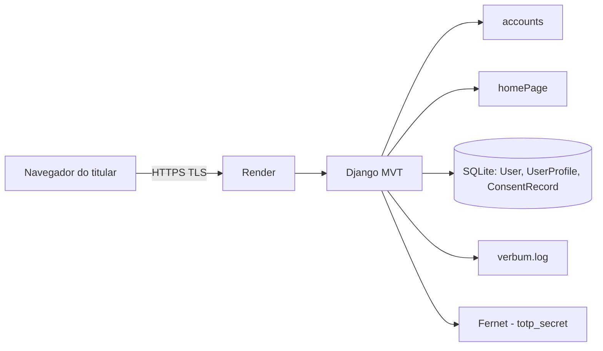

# Documentação Técnico-Científica — Verbum Academy

Projeto Integrador — Políticas de Segurança da Informação  
Itens 6.1 a 6.12 da rubrica (item 4.6 do enunciado)

Aplicação: https://verbum-academy.onrender.com/  
Repositório: https://github.com/sarahmazoni/Verbum_Academy  
Equipe: Sarah, Henrique, Gabriel

Fontes: README.md, docs/seguranca.md, docs/implementacao.md, docs/recuperacao-senha.md, docs/lgpd.md, docs/testes.md, docs/auditoria-logs.md, docs/evidencias/.

---

## 6.1 Documento de visão geral do sistema

O **Verbum** é uma plataforma web de aprendizagem de idiomas baseada em vocabulário de alta frequência, gramática, expressões frequentes e acompanhamento do progresso do estudante.

No escopo desta disciplina, o sistema implementa autenticação e gestão de credenciais, autenticação de dois fatores (2FA TOTP), recuperação de senha por token temporário, criptografia em trânsito e em repouso, conformidade com a LGPD (Lei nº 13.709/2018) e auditoria de eventos críticos.

**Stack:** Python e Django (arquitetura MVT), SQLite, HTML, CSS e JavaScript. Ambiente de avaliação publicado no Render com HTTPS: https://verbum-academy.onrender.com/

**Módulos:** accounts/ (cadastro, login, 2FA, reset, privacidade e auditoria), homePage/, templates/ e docs/.

---

## 6.2 Diagrama de arquitetura

O cliente acessa o Render por TLS. O Django persiste contas no SQLite, grava eventos em verbum.log (modo append) e protege o segredo TOTP com Fernet (accounts/crypto.py). A chave criptográfica é lida da variável de ambiente VERBUM_ENCRYPTION_KEY e não é versionada no Git.

---

## 6.3 Fluxos de autenticação e dados

**Autenticação.** O cadastro ocorre em register() (accounts/views.py) com create_user() e checkbox de consentimento desmarcado por padrão. O login ocorre em login_view(): busca do e-mail com iexact e validação por authenticate(). Se two_factor_enabled estiver ativo, o fluxo segue para verify_2fa() com TOTP (pyotp). A sessão usa login_required, SESSION_COOKIE_AGE = 1800, SESSION_SAVE_EVERY_REQUEST = True e SESSION_COOKIE_HTTPONLY = True. O logout em logout_view() invalida a sessão. O bloqueio ocorre após 5 tentativas, com locked_until de 5 minutos.

**Recuperação de senha.** O titular acessa /accounts/password-reset/. PasswordResetRequestView gera token HMAC (PasswordResetTokenGenerator) sem gravar o token no banco. O tempo de vida é PASSWORD_RESET_TIMEOUT = 900. A confirmação ocorre em PasswordResetConfirmView. Após a troca da senha o token perde validade. Token expirado, adulterado ou reutilizado resulta em tela de link inválido e log de falha. Detalhamento: docs/recuperacao-senha.md.

**Dados pessoais.** No cadastro é gravado ConsentRecord (finalidade, data e versão 1.0 da política). O titular autenticado usa /accounts/privacidade/ para consulta, exportação JSON, revogação do consentimento e exclusão da conta (confirmação com e-mail e senha). Detalhamento: docs/lgpd.md.

---

## 6.4 Gestão de credenciais

| Mecanismo | Implementação | Onde |
|---|---|---|
| Hash + salt | Sistema de senha do Django via create_user(); a senha não é gravada em texto puro | accounts/views.py |
| Política de senha | Validadores nativos do Django | Verbum/settings.py |
| 2FA | TOTP com pyotp; campos totp_secret e two_factor_enabled | setup_2fa(), verify_2fa() |
| Tentativas | 5 falhas e bloqueio de 5 minutos | UserProfile |
| Sessão | 30 minutos e cookie HttpOnly | settings.py |
| Logout | logout() do Django | logout_view() |
| Reset | Token HMAC temporário, 900 s, uso único | PasswordReset*View |

Fonte: docs/seguranca.md e docs/implementacao.md.

---

## 6.5 Uso de criptografia

**Em trânsito:** comunicação HTTPS/TLS no ambiente publicado no Render.

**Em repouso:** a senha é armazenada apenas como hash com salt do Django. O campo totp_secret é cifrado com Fernet em accounts/crypto.py, pelas funções encrypt_totp_secret() e decrypt_totp_secret(). O esquema Fernet combina AES-128-CBC e HMAC-SHA256. A chave é a variável VERBUM_ENCRYPTION_KEY, fora do código e do banco.

O token de recuperação não é persistido. Os logs não gravam senha, token, código 2FA nem secret TOTP. A cifra do TOTP reduz o impacto de um eventual dump do SQLite e evita implementação manual de algoritmo criptográfico. Fonte: docs/seguranca.md, seções 8 a 11.

---

## 6.6 Identificação dos ativos

| Ativo | Onde | Classificação |
|---|---|---|
| Contas (username, e-mail) | SQLite, modelo User | Dado pessoal |
| Hash da senha + salt | User.password | Credencial |
| Segredo TOTP cifrado | UserProfile.totp_secret | Segredo de autenticação |
| Flag 2FA e bloqueio de login | UserProfile | Controle de segurança |
| Consentimento | ConsentRecord | Prova LGPD (art. 8º) |
| Sessão / cookie HttpOnly | navegador e Django | Acesso autenticado |
| Token de reset | memória/URL; não vai ao banco | Credencial temporária |
| verbum.log | arquivo local e tela /accounts/auditoria/ | Auditoria |
| DJANGO_SECRET_KEY | variável de ambiente | Chave da aplicação |
| VERBUM_ENCRYPTION_KEY | variável de ambiente | Chave Fernet |

---

## 6.7 Ameaças e vulnerabilidades

- Força bruta e credential stuffing no login
- Armazenamento de senha ou secret TOTP em texto puro
- Reuso ou adulteração do token de recuperação
- Sequestro de sessão
- Tráfego HTTP sem TLS
- Alteração ou apagamento de logs pela interface
- Coleta excessiva de dados pessoais
- Versionamento no Git de SECRET_KEY ou da chave Fernet
- Dump do arquivo SQLite no ambiente de avaliação

---

## 6.8 Associação risco x contramedida

| Ameaça | Contramedida no Verbum | Evidência |
|---|---|---|
| Força bruta | 5 tentativas e bloqueio de 5 minutos | 09-bloqueio-tentativas.png, 32-conta-bloqueada.png |
| Senha em claro | hash e salt do Django | docs/seguranca.md |
| Senha fraca | validadores do Django | 10-teste_validacao_senha.png |
| Conta sem segundo fator | TOTP após a senha | 07-verifica-2fa.png, 34-2fa-sucesso.png |
| Código 2FA inválido | recusa e evento 2FA_FAILURE | 33-2fa-falha.png |
| Replay de token | HMAC, 900 s e invalidação após uso | 17-token-reutilizado.png, 18-token-invalido.png |
| Sessão persistente | 1800 s, HttpOnly e logout | 05-painel-com-login.png, 35-logout.png |
| Tráfego interceptado | HTTPS no Render | 22-https-home.png, 23-https-cadeado.png |
| Secret TOTP em claro | Fernet e chave em variável de ambiente | docs/testes.md, testes 21 a 23 |
| Log adulterado pela UI | gravacao append e tela somente leitura | 36-tela-auditoria.png |
| Coleta excessiva | cadastro mínimo e consentimento explícito | docs/lgpd.md |

---

## 6.9 Testes de segurança realizados

Os testes foram executados pelo front-end, conforme exigência da disciplina. Os roteiros estão em docs/testes.md, docs/lgpd-testes.md e docs/auditoria-logs.md. As capturas estão em docs/evidencias/.

Casos exercitados: política e confirmação de senha; rota protegida sem sessão; 2FA válido e inválido; bloqueio após cinco falhas; token de reset reutilizado e inválido; logs sem segredo; armazenamento do totp_secret como token Fernet; fluxo completo de 2FA com segredo cifrado; consulta somente leitura da auditoria; HTTPS no ambiente publicado; minimização e consentimento no cadastro.

---

## 6.10 Resultados dos testes documentados

| Teste | Resultado | Evidência |
|---|---|---|
| Cadastro válido | Aprovado | 01-cadastro-sucesso.png |
| Senhas diferentes | Aprovado | 02-senhas-diferentes.png |
| Login e painel | Aprovado | 05-painel-com-login.png |
| Rota 2FA sem login | Aprovado | 06-setup2fa-sem-login.png |
| 2FA | Aprovado | 07-verifica-2fa.png |
| Bloqueio por tentativas | Aprovado | 09-bloqueio-tentativas.png |
| Política de senha | Aprovado | 10-teste_validacao_senha.png |
| Pedido de recuperação | Aprovado | 11 a 13 |
| Redefinição válida | Aprovado | 15 e 16 |
| Token reutilizado | Aprovado | 17-token-reutilizado.png |
| Token inválido | Aprovado | 18-token-invalido.png |
| Logs de recuperação | Aprovado | 19 a 21 |
| Fernet no totp_secret | Aprovado | docs/testes.md, testes 21 a 23 |
| Bloqueio e auditoria | Aprovado | 32 a 36 |
| HTTPS | Aprovado | 22 e 23 |

Nenhum dos casos de segurança listados foi reprovado no front-end.

---

## 6.11 Uso de artigos científicos e normas técnicas

As escolhas de segurança do Verbum foram fundamentadas em normas técnicas e guias de referência, e não em implementação ad hoc:

- Armazenamento de senha com hash e salt: documentação oficial do Django (Password management) e NIST SP 800-63B, relativos a autenticadores memoráveis e resistência a ataque offline.
- Segundo fator TOTP: RFC 6238, implementado com a biblioteca pyotp.
- Token de recuperação: gerador HMAC do Django, com expiração de 900 segundos e uso único, alinhado à recomendação de autenticador de uso limitado do NIST SP 800-63B.
- Criptografia autenticada em repouso do totp_secret: esquema Fernet (AES-128-CBC + HMAC-SHA256) da biblioteca cryptography.
- Comunicação em trânsito: TLS/HTTPS no ambiente publicado no Render.
- Análise ativo-ameaça-contramedida: abordagem compatível com a ISO/IEC 27001.
- Tratamento de dados pessoais: Lei n. 13.709/2018 (LGPD), arts. 6, 7, 8, 18 e 46.
- Práticas de autenticação em aplicação web: OWASP Authentication Cheat Sheet (bloqueio de tentativas, sessão e segundo fator).

---

## 6.12 Referências

BRASIL. Lei n. 13.709, de 14 de agosto de 2018. Lei Geral de Proteção de Dados Pessoais (LGPD). Brasília, DF: Presidência da República, 2018. Disponível em: http://www.planalto.gov.br/ccivil_03/_ato2015-2018/2018/lei/l13709.htm. Acesso em: 25 set. 2026.

DJANGO SOFTWARE FOUNDATION. Password management in Django. Documentação oficial. Disponível em: https://docs.djangoproject.com/en/stable/topics/auth/passwords/. Acesso em: 25 set. 2026.

INTERNET ENGINEERING TASK FORCE. RFC 6238: TOTP - Time-Based One-Time Password Algorithm. 2011. Disponível em: https://www.rfc-editor.org/rfc/rfc6238. Acesso em: 25 set. 2026.

ISO. ISO/IEC 27001: Information security, cybersecurity and privacy protection - Information security management systems - Requirements. Genebra: ISO.

NATIONAL INSTITUTE OF STANDARDS AND TECHNOLOGY. Digital Identity Guidelines: Authentication and Lifecycle Management. NIST Special Publication 800-63B. Gaithersburg: NIST. Disponível em: https://pages.nist.gov/800-63-3/sp800-63b.html. Acesso em: 25 set. 2026.

OWASP. Authentication Cheat Sheet. OWASP Foundation. Disponível em: https://cheatsheetseries.owasp.org/cheatsheets/Authentication_Cheat_Sheet.html. Acesso em: 25 set. 2026.

Documentos internos do projeto:

VERBUM ACADEMY. Segurança. Repositório Verbum_Academy, arquivo docs/seguranca.md.

VERBUM ACADEMY. Documentação da implementação. Repositório Verbum_Academy, arquivo docs/implementacao.md.

VERBUM ACADEMY. Recuperação de senha. Repositório Verbum_Academy, arquivo docs/recuperacao-senha.md.

VERBUM ACADEMY. Conformidade com a LGPD. Repositório Verbum_Academy, arquivo docs/lgpd.md.

VERBUM ACADEMY. Testes da aplicação. Repositório Verbum_Academy, arquivo docs/testes.md.

VERBUM ACADEMY. Auditoria e logs. Repositório Verbum_Academy, arquivo docs/auditoria-logs.md.
